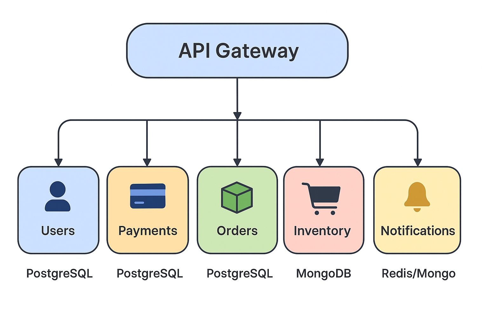

# Ì∑ÑÔ∏è Persist√™ncia Distribu√≠da e Poliglota

Este documento descreve como o projeto **Microstack-j** implementa uma estratégia de **persistência poliglota**, onde cada **microserviço** adota o tipo de banco de dados mais adequado ao seu domínio e perfil de acesso.

---

## ÌæØ Objetivo

Garantir **isolamento de dados**, **autonomia dos microserviços** e **flexibilidade tecnológica** na camada de persistência, mantendo a consistência e a escalabilidade da aplicação.

Cada microserviço possui **seu próprio banco de dados**, podendo adotar tecnologias diferentes (SQL ou NoSQL) conforme o tipo de dado e o padrão de uso.

---

## Ì∑© Distribui√ß√£o dos Bancos de Dados

| Microserviço   | Tipo de Dados           | Tecnologia Sugerida     | Justificativa Técnica                                                                 |
|----------------|------------------------|--------------------------|---------------------------------------------------------------------------------------|
| **Users**         | Estruturados e relacionais | **PostgreSQL**             | Garantia de integridade referencial e suporte a transações ACID.                      |
| **Orders**        | Relacionais e consistentes  | **MySQL** ou **PostgreSQL** | Modelo cl√°ssico de pedidos e pagamentos; estrutura tabular e joins.                   |
| **Payments**      | Transacionais e críticos    | **PostgreSQL** ou **MongoDB** | Necessidade de atomicidade e histórico de transações.                                |
| **Inventory**     | Dados semiestruturados      | **MongoDB**                | Estrutura flexível de produtos e estoques dinâmicos.                                 |
| **Notifications** | Eventos assíncronos e logs  | **Rust + Redis** ou **Kafka** | Alto volume de mensagens, escrita massiva e baixa latência.                          |

---

## Ì∑† Conceito de Persist√™ncia Poliglota

> Persistência poliglota é o uso de **múltiplos tipos de bancos de dados** dentro da mesma aplicação, escolhendo o melhor mecanismo para cada domínio ou caso de uso.

**Vantagens:**
- Escolha do banco ideal por tipo de dado.
- Maior desempenho em consultas específicas.
- Escalabilidade independente por serviço.

**Desvantagens:**
- Maior complexidade de integração e manutenção.
- Possível inconsistência entre bancos heterogêneos.
- Necessidade de ferramentas de observabilidade e sincronização.

---

## ÌøóÔ∏è Diagrama de Persist√™ncia Distribu√≠da

---

## ⚙️ Diretrizes de Implementação

- Cada microserviço mantém **seu próprio schema ou instância de banco**.
- Evite comunicação direta entre bancos de dados.
- Utilize **eventos assíncronos (mensageria)** para sincronizar domínios.
- Mantenha scripts de inicialização e migração separados por microserviço.
- Documente as decisões de persistência no diretório `docs/architecture/`.

---

## Ì≥ö Refer√™ncias Recomendadas

- *Designing Data-Intensive Applications* – Martin Kleppmann  
- *Fundamentos de Engenharia de Dados* – Joe Reis & Matt Housley  
- *NoSQL Distilled* – Pramod Sadalage & Martin Fowler  
- *Building Microservices* – Sam Newman  

---

> **Nota:** À medida que o Microstack-j evoluir, novos microserviços poderão adotar diferentes tecnologias de armazenamento, reforçando a flexibilidade e a escalabilidade do sistema.

